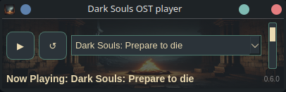

# Dark Souls OST Player
This is a simple music streamer project for my understanding of git

- Language : Python
- Release format : Flatpak

## Download

It has bee dificult to get my PR in flathub so for now it will only be in github.

It's been a great way to understand audio stream, Buffer, Chunks.

# Disclaimer

The audio tracks played in this application are not owned by me and are hosted by a third party. This project is a media player designed to stream audio content that is publicly available on the internet. 

I do not claim ownership of any audio files or their associated copyrights. All rights to the original audio content are owned by their respective copyright holders. 

