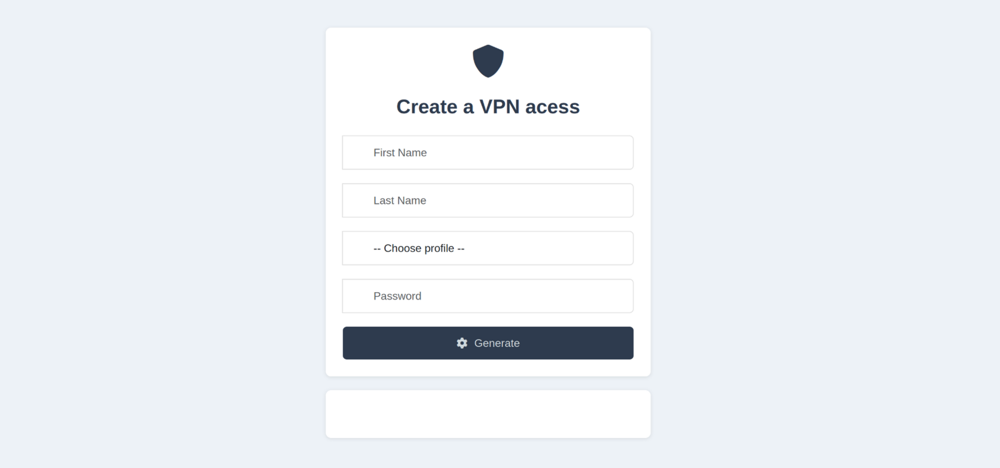

This Project connect on a Mikrtotik router and create a vpn client according ton customisable template.

It will then download the certs and zip them making them available to the frondend.




### Backend

- Go / YAML

### Frontend

- HTML / JS
  
## Requirements

- Go
- Nginx
- Mikrotik certificate (for TLS)

##  How to Use

1. Clone the repository:
    ```bash
    git clone https://github.com/neph-IO/mikrotik-vpn-gen.git
    cd mikrotik-vpn-gen
    cp config.example.yaml config.yaml
    ```

2. Edit `config.yaml` to match your MikroTik and environment settings.

3. Edit the `template/Client.ovpn` file to fit your OpenVPN setup.

4. Place your CA certificate (e.g. `ca2025.crt`) in the `template/` folder.

5. Copy the frontend HTML (`frontend/vpncreator.html`) into your Nginx `www/` directory.

6. Run the backend API:
    ```bash
    go run cmd/mikrotik-vpn-gen/init.go
    ```

##  Nginx Configuration

In your Nginx site config, add a reverse proxy to forward API requests:

```nginx
location /api/ {
    proxy_pass http://localhost:8081;
    proxy_set_header Host $host;
    proxy_set_header X-Real-IP $remote_addr;
}
 ```
## 📝 Notes

- **You must update the frontend's `<select>` dropdown to match your MikroTik profiles.**  

Copy this line (247) as many times as needed:
 ```
<option>OpenVpnProfile1</option>
```


docker option will be soon available.


