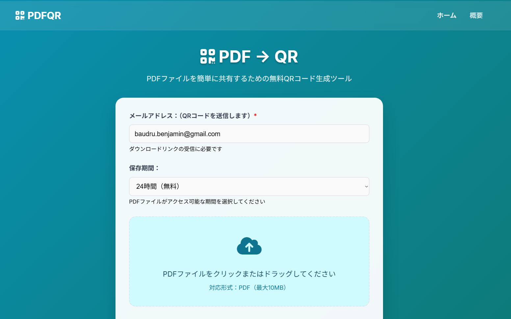

After searching for an idea to build my first online service, I discovered that one of the top 15 most searched tech-related queries in Japan is a **safe PDF-to-QR conversion service**.

So, I decided to build and self-host the service at home, offering a free 24-hour tier tailored to the Japanese market:

 [https://pdfqr.jp](https://pdfqr.jp)

---

## Stack

- **Frontend**: HTML + CSS + JS  
- **Network**: Cloudflare + Docker  
- **Backend**: Go + Nginx + MariaDB + Purelymail  

---

## Goal

Minimize friction for the user by reducing the number of clicks needed to get their QR code.

I also made it a point to collect as little personal data as possible to respect user privacy.

---

## How does it work?

The user visits the site, enters their email, selects how long the PDF should be available (24h for free, or a paid plan), uploads the PDF (drag & drop also works), and clicks to proceed.  
If it's a paid plan, a secure PayPal modal appears. Once the payment is complete, the PDF is uploaded and a database entry is created with an expiration date.

---

###  Data Privacy

- **Email**: Only used to send the QR code in case the user refreshes the page before downloading it.
- **Name and other details**: Collected **only by PayPal**, in accordance with "Know Your Customer" regulations — **never by me**.
- The database stores only the **bare minimum** needed to ensure service quality — for example, allowing refunds or deletion on request. The only  customer-identifiable info stored is the email address **provided by the user**.

---

###  Data Deletion

It's simple: when the file expires (based on the chosen retention time), both the file and its database entry are **completely deleted**.  
**No soft deletion. No hidden tags. It's gone.**

